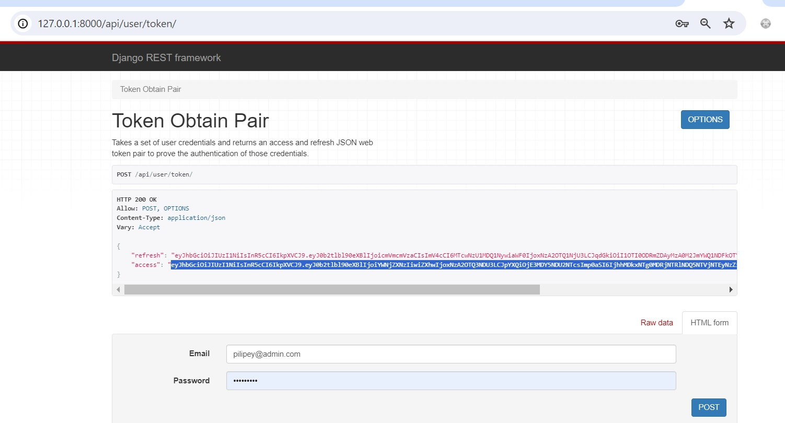

# <center >Library service</center>
This service provides information about available books and allows you to borrow them to read and return them. For the administration, it also provides the possibility to create books, to receive notification by telegram about book rentals and to monitor the timely return of books.
---
           

## <center >Manual Build</center>
1. In Pycharm, open the folder where the project will be stored.
2. Cloning the project.  
    ```shell
    git https://github.com/AnatoliyPilipey/LibraryService.git
    ```
3. Go to the folder with the project.  
    ```shell 
    cd TrainStationWithPriceTrip
    ```
4. Creating a virtual environment.  
    ```shell 
    python -m venv venv
    ```
5. Activating the virtual environment.  
    * For Apple 
    ```shell     
    source env/bin/activate
    ```
    * For Windows  
    ```shell 
    venv\Scripts\activate
    ```
6. Install the required modules from the specified list.  
    ```shell 
    pip install -r requirements.txt
    ```
7. Create an .env file and put the secret key in it.  
    ```shell 
    SECRET_KEY=django-insecure-=^im3gko#&wa^50ejpfn^vjzb5=_h4$r@+v!6s!o6269ej%)l9
    ```
8. Perform database creation migrations.  
    ```shell 
    python manage.py migrate
    ```
9. Create admin for db
    ```shell 
    python manage.py createsuperuser
    ```
10. Disabling authentication. Specify in the .env
    ```shell 
    PERMISSIONS_STATUS = off
    ```
11. To use JWT authentication.  
    Specify in the .env
    ```shell 
    PERMISSIONS_STATUS = on
    ```  
    Run server
    ```shell 
    python manage.py runserver
    ```  
    Token Obtain Pair
    ```shell 
    http://127.0.0.1:8000/api/user/token/
    ```  
    Use login & password for admin
    ```shell 
    admin@admin.com password
    ```  
      
    Use ModHeader by specifying 
    ```shell 
    Bearer you_access_Token_time_life_30_min
    ```  
    
12. Running the server  
    ```shell 
    python manage.py runserver
    ```
13. At this point, the app runs at  
    ```shell 
    http://127.0.0.1:8000/api/library_service/
    ```
14. Register new User  
    ```shell 
    http://127.0.0.1:8000/api/user/create/
    ```
15. Swagger  
    ```shell 
    http://127.0.0.1:8000/api/doc/swagger/
    ```
16. Redoc
    ```shell 
    http://127.0.0.1:8000/api/doc/redoc/
    ```
17. To check your overdue leases on a daily basis, follow these steps. First of all, install and configure Docker.
18. Running redis in Docker
    ```shell 
    docker run --name redis -d -p 6379:6379 redis
    ```
19. Run Celery worker
    ```shell 
    celery -A taskmanagment worker -l info
    ```
20. Run Celery beat
    ```shell 
    celery -A taskmanagment beat -l INFO
    ```
21. Now you need to go to the admin to connect periodic tasks and customize their execution.
22. You can run the application through the Docker, for this purpose execute the following command.
    ```shell 
    docker-compose build
    ```
    ```shell 
    docker-compose up
    ```
#### Note

_Thank you for familiarizing yourself with my work._
